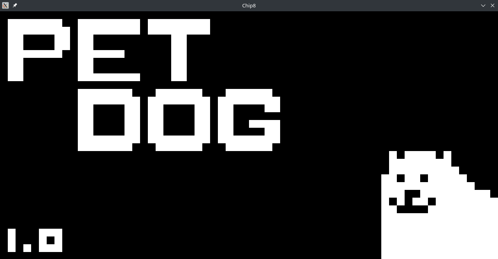

# Chip8 Emulator

## Description

A [Chip8](https://en.wikipedia.org/wiki/CHIP-8) emulator written in C++.

The following image is an example of the rom [pet dog](https://johnearnest.github.io/chip8Archive/play.html?p=petdog) by SystemLogoff running on this emulator.



----------------------

## Table of Contents

<!-- no toc -->
- [Build](#build)
- [Features](#features)
- [Usage](#usage)
- [Motivation](#motivation)
- [References and links](#references-and-links)

## Build

The recommended way to build this program, is to use CMake.
To build on Windows, generate a Visual Studio solution using CMake; on Linux, simply configure CMake and run ``cmake --build`` from command line.

When downloading the repository, use

```bash
$ git clone --recursive git@github.com:mfruttid/chip8-emu.git
```

in order to download all the dependencies.

## Features

- **Option to use Super Chip8 instructions:** there are some Chip8 instructions (`8XY6`, `8XYE`, `FX55` and `FX65`) that have a different implementation for the SChip. Some Chip8 roms are programmed to work using the SChip implementation. In order to make it compatible, there is the option to use the SChip instructions by adding the flag `-s` when running the program.

- **Option to wrap sprites:** the original implementation of the drawing instruction clips sprites that exceed the width of the screen, but some roms need the sprite to wrap in order to work properly. You can adjust this setting by adding the flag `-w` when running the program so that the sprites wrap around the screen.

- **Emulation of old phosphor screens effect:** due to the way Chip8 handles its screen, it is normal to experience some flickering on modern monitors. On older screens, this was not a probelm, because whenever a pixel was unset, it would gradually turn off, fading away. On modern screens, the flickering of the pixels can be quite unpleasant for the eyes, so I implemented a fading effect, simulating the old phosphor screens. This effect can be disabled by using the flag `-n` when running the program.

- **Multi-platform:** runs on both Windows and Linux (not tested on other platforms).

## Usage

Run the `Chip8` executable from command line with the path to a Chip-8 rom as argument (you can find some roms at the following [link](https://johnearnest.github.io/chip8Archive/)).

```text
$ Chip8[.exe] [options] <path/to/rom.ch8>
```

For further instructions, use the flag `-h`. Other options are

- `-s` to interpret instructions `8XY6`, `8XYE`, `FX55` and `FX65`  in SChip compatibility mode (default: use instructions for Chip8);
- `-w` to require the drawing instruction to wrap the sprites (default: the drawing instruction clips sprites);
- `-n` to disable the fading effect of the pixels, making them flicker (default: unset pixels slowly fade to black).

The arguments can be inserted in any order.

## Motivation

The main motivation behind this project is to gain more familiarity with low level programming concepts and with modern C++.
While working on this project I learned

- basics of CPU architectures: registers, register types, (symbolic) machine code...
- SDL2
- base64 encoding and decoding of binary data
- multi-threading


## References and links

- <https://github.com/mattmikolay/chip-8/wiki> and <http://devernay.free.fr/hacks/chip8/C8TECH10.HTM> for technical documentation about Chip8
- <https://johnearnest.github.io/chip8Archive/> is an archive of programs written for Chip8 and Super Chip8
